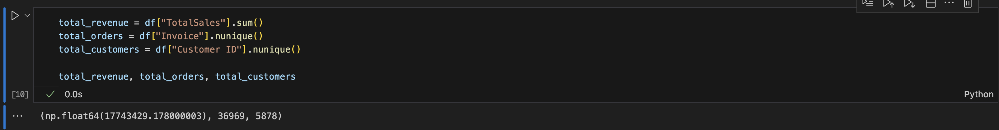

📊 E-commerce Data Analysis & Business Insights
📌 Project Overview

This project analyzes real-world e-commerce transaction data to extract actionable business insights. The goal is to demonstrate strong skills in data cleaning, data analysis, testing, and insight generation using Python.

The analysis focuses on understanding sales performance, customer behavior, and product trends to support data-driven decision-making.

## 🔥 Quick Preview

🗂 Dataset

The dataset contains transactional e-commerce data including:

Invoice information

Product descriptions

Quantities and prices

Customer identifiers

Country of purchase

To respect licensing and file size constraints, only the cleaned dataset is included in this repository.

🔧 Tools & Technologies

Python

Pandas & NumPy

Matplotlib

Visual Studio

Jupyter Notebook

🔍 Key Analysis Steps

Data cleaning and preprocessing

Handling missing and invalid values

Feature engineering (total sales, time-based features)

Exploratory Data Analysis (EDA)

Data quality testing and validation

Business insight generation

📈 Key Business Metrics

Total Revenue

Total Orders

Total Customers

📊 Visual Insights
Monthly Sales Trend

Top Products by Revenue

Top Countries by Revenue

💡 Business Recommendations

Focus inventory and marketing on top-performing products.

Use seasonal trends to optimize promotions and stock planning.

Target high-revenue countries for growth opportunities.

Continuously monitor customer purchasing behavior for retention strategies.